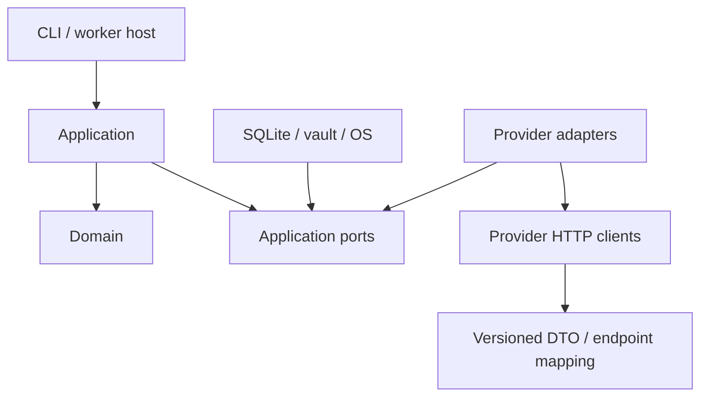

# Architecture

設計日: 2026-09-14。設計判断。API根拠は[調査書](api-capability-research.md)。

## 境界と依存方向

矢印はコンパイル時の依存。実行時にはApplicationが注入されたportを呼ぶ。composition rootのみ具象AdapterとInfrastructureを参照する。DomainはSNS SDK、JSONレスポンス、HTTP status、SQLite、OS APIを参照しない。

同一process内のモジュール構成とし、ネットワークRPC、message broker、microservices、動的プラグインローダーを導入しない。CLIとworkerは同じapplication use caseを利用するが、**投稿HTTPを実行できるのはworkerの排他ロックを保持した実行経路だけ**。

## レイヤ

| 層 | 所有するもの | 所有しないもの |
| --- | --- | --- |
| Domain | Content、Schedule、Publication、不変条件、状態遷移 | SNS scope名、HTTP、API DTO |
| Application | enqueue、実行・照合・取消・stats orchestration、transaction境界、port | EndpointやSNS名のswitch |
| Provider Adapter | 意味への変換、動的能力、options検証、実行step計画、metrics定義、OAuth差分 | DB接続・worker起動 |
| Provider API Client | HTTP、API version、wire DTO、明示した認証ヘッダ | ドメインの成功判定 |
| Infrastructure | SQLite repository、vault、排他、時刻、ファイル、OS起動登録 | 投稿形式の判断 |
| CLI / Host | 入出力、依存注入、終了コード、OS taskへの入口 | 投稿の再試行規則 |

共通HTTPクライアントは接続・timeout・安全な診断のみ。POSTの自動retryは無効。readも含めた永続retryの決定権はApplicationに1か所だけ置く。

## Providerの差分を保持する方法

Canonical Contentはtext/images/video等の入力の意味。YouTube title、madeForKids、Instagram shareToFeed、TikTok privacy・商用開示は、Adapter所有のversion付きOptions契約に置く。wire DTOをそのままoptionsへ露出しない。Provider追加時はcomposition root登録、独立したAdapter、fixtures、文書を追加する。

Capabilitiesはboolean一覧ではなく、利用可否、条件、必要入力、アカウント・app権限、媒体制約、確認日時を返す。coreは「input-required」「blocked」「unsupported」等の共通結果を解釈する。TikTokだけをcore内で特別扱いしない。

## Publish workflow

1. CLIが設定・対象aliasを解決し、全対象を検証する。
2. 素材を管理領域へ固定コピーしhashを確定する。
3. 同一transactionでPost revision、Targets、Publications、Jobs、ローカル冪等キーを保存する。
4. workerが対象Publicationをclaimし、Adapterから次のstepと副作用分類を得る。
5. dispatch intentをcommitした後にHTTPを実行する。
6. 得られたreceipt、暗号化checkpoint、状態、次jobを同一transactionでcommitする。
7. 不明な副作用はreconcileへ。未確定のpublishを汎用retryへ落とさない。

転送・公開・処理完了は別の段階。外部IDを持つことだけでPublishedにはしない。Adapter内の手順は[Provider契約](provider-contract.md)、workerの回復は[予約仕様](scheduling.md)。

## SchedulerとOS

SQLite Jobsが唯一のqueue。OS taskはworkerを起動・再起動するだけで、投稿1件ごとにOS taskを作らない。単一workerはinstallationごとに1 coordinator processという意味で、全HTTPを1本ずつ直列実行する意味ではない。worker内dispatcherはPublication/AuthGrant等のowner単位を直列化しつつ、期限付きpublishを優先して少数の非同期operationを並行実行する。初期上限はglobal 2、provider/accountごとは1とし、bulk/低priority operationは同時1までに制限して残り1 slotを期限付きpublish・必要なrefresh/reconcileへ予約する。設定で無制限に増やさない。長いuploadは可能ならchunkごとにcheckpointしてdispatcherへ制御を戻す。stats/cleanupはpublish準備・公開より低priorityとする。

時刻精度はworker loopで管理する。既定はログオン中のユーザーtask、追加プロファイルで非ログオン時起動を設計する。Windows Serviceは採用しない。キー利用主体と実行主体を一致させる。shutdown時は新規claimを止め、in-flight operationの結果保存を待つ。期限内に終了できない操作は強制的に成功/失敗へ確定せず、保存済みDispatchPreparedから復旧する。

## Persistence / Auth / Analytics

SQLiteでqueueと投稿状態をtransactionally管理する。素材はfilesystem、秘密payloadは暗号化してSQLite、master keyはOS credential store。APIアカウントとOAuth grantを分離し、同一grantのtoken refreshを直列化する。

Raw metricsを保存してからversion付きNormalizerがprojectionを作る。rawに規約上の保持期限を付け、過去のprojectionを現在値へ上書きしない。Account指標を特定投稿の成果に付け替えない。

## 予定リポジトリ構成

| パス | 責務 |
| --- | --- |
| src/PostRouter.Cli | System.CommandLine、composition root、worker host |
| src/PostRouter.Domain | 純粋モデル・状態遷移 |
| src/PostRouter.Application | use cases、ports |
| src/PostRouter.Infrastructure | SQLite、vault、storage、Windows task |
| src/PostRouter.Providers.X | Adapter / Api / V2 / Normalization |
| src/PostRouter.Providers.YouTube | Adapter / DataV3 / AnalyticsV2 / Auth |
| src/PostRouter.Providers.Instagram | Adapter / InstagramLogin / version mapping |
| src/PostRouter.Providers.TikTok | Adapter / V2 / policy gate |
| tests | Unit / Integration / ProviderContracts / WindowsRecovery |
| docs | 本設計書 |
| contracts | CLI入出力schema、投稿manifest、provider options schema |

Phase 1ではDomain / Application / Infrastructure / CLIとFake Providerをこの配置で実装した。実SNS Providerプロジェクトは各該当Phaseで追加し、SDK由来型を各Providerプロジェクトの内部可視性に閉じる。

## 変更の波及

Endpoint・scope・DTO変更は該当Adapter内。指標定義変更は該当provider metric catalogとNormalizer。新しい共通の意味が必要な場合にのみDomainとcontract versionを変更する。外部API変更の全てをcore無変更で吸収できるとは約束しない。

checkpointはAdapter別versionを持つ。新Adapterが旧checkpointを読めない場合はNeedsAttentionにして停止し、旧API互換readerまたは移行処理を追加する。新しいpublishとして作り直さない。
