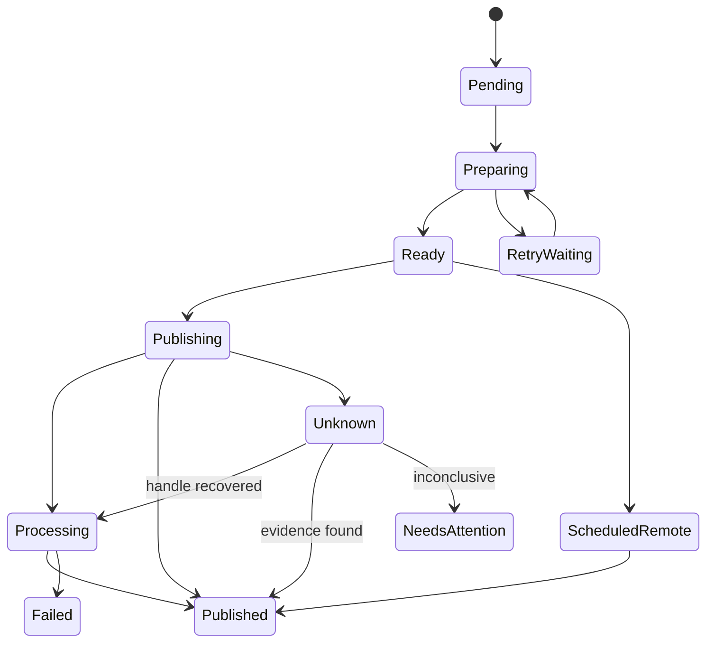

# Scheduling and recovery

設計契約 v1 / 2026-09-14。予約は「希望公開時刻」の契約であり、全SNSで同時刻の公開を保証する契約ではない。

## 実行方式

| 方式 | 採用対象 | 稼働条件 |
| --- | --- | --- |
| Native | YouTubeのprivate・未公開動画を事前uploadしてpublishAt登録 | 登録・確認まではPCとネットワークが必要。登録後の公開はprovider担当 |
| Local | X、Instagram | 公開時刻付近に同一ユーザーのworker・ネットワーク・有効な認証が必要 |
| Human completion | TikTok Uploadを別途採用できる場合 | inbox送信後に人間がアプリで完了。時刻予約として提供しない |
| Policy blocked | 本プロジェクト用途のTikTok Direct Post | workerへ送信jobを生成しない |

ApplicationはScheduleとProviderの実行計画を組み合わせる。実行方式はPublicationに固定保存する。native登録の失敗・タイムアウトを理由にlocalへ自動切替しない。登録済みでないと証明でき、再計画が安全な場合のみ明示変更する。

準備と公開を分離する。YouTubeはenqueue後なるべく早くprivate upload・予約登録を行う。XのmediaやIGのcontainerは有効期限があるため、adapterの確認済み期限と推定upload時間から準備時刻を決める。期限未確認のstagingを長期予約時に先行生成しない。準備完了してもlocal公開はdueAt前に送らない。

## 状態機械

図は主要経路。以下が例外遷移の正本となる。

| 現在の条件 | 遷移・操作 |
| --- | --- |
| localの未送信、dueAt到来 | ReadyからPublishing。Attempt intentを先にcommit |
| native登録成功 | ScheduledRemote。公開確認pollを予約 |
| 安全な操作に対する一時障害 | RetryWaiting。resumeStateとnextAllowedAtを保存し、元段階へ戻る |
| 公開し得るrequestが成否不明 | Unknown。publish retryを禁止しreconcile jobのみ |
| 認証取消、権限不足、能力変更 | NeedsAttention。AccountはReauthRequired等 |
| 審査中・transcoding | Processing。provider handleで追跡 |
| inbox等で人間の操作が必要 | AwaitingUser。Publishedと表示しない |
| 結果が確定した拒否 | Failed。修正可能性と再実行の安全性を別々に記録 |
| 未送信のまま遅延期限超過 | Expired。勝手な翌日投稿をしない |
| 取消要求 | CancelRequested。未送信ならCancelled、remote操作が必要なら確認まで保留 |

Processing/UnknownからFailedへ移すにはremote失敗の証拠が必要。管理上のpoll上限に達しただけならNeedsAttention。Unknown/NeedsAttentionでも後から公開が確認されればPublishedへ移す。公開履歴は削除しない。

## 永続queueと排他

SQLite transactionでPost、Target、Publication、初回Jobを一括登録する。外部HTTPはDB transaction中に行わない。queueのJob状態はQueued / Claimed / Done / Blocked / Cancelledで、Publicationの公開状態とは別。

workerはinstallationの固定lock fileをOSの排他ハンドルで保持する。lock fileを削除して奪う方式は禁止。同じユーザーのCLIを含め、投稿系remote mutationはworkerだけが実行する。DBのgeneration条件付きUPDATEでjobをclaimする。lease期限は監視用で、期限切れだけで第2workerを起動・同じjobを奪取しない。process停止・OS lock解放を確認したworkerだけがrecoverする。

スリープから旧workerが復帰する場合にもOS lockが残るため第2workerは開始しない。hung workerの再起動は明示停止後に実施する。killしても既に送信されたHTTPのremote処理は取消されないので、残されたAttemptを照合する。

## HTTP境界と復旧

1. adapterが次の1操作とreplaySafetyを提示する。
2. DBにDispatchPrepared、stepKey、request digest、既知handleをcommitする。
3. APIへ1操作だけ送信する。
4. responseから抽出したreceipt、remote ID、checkpoint、次jobを1 transactionでcommitする。
5. commit成功後だけ次操作へ進む。

DispatchPreparedは「送信済み」と「送信直前crash」を区別できない。新workerは両方を成否不明として扱う。メモリ上のresponseが成功でもDB書込失敗なら先へ進まない。

| crash位置 | 復旧 |
| --- | --- |
| enqueue commit前 | 登録なし。同じidempotency keyで再enqueue可能 |
| enqueue commit後、CLI応答前 | 同じkeyで既存Postを返す |
| DispatchPrepared前 | 未送信jobを通常実行 |
| Prepared後、receipt commit前 | Readは再取得。既知sessionはstatus確認。公開し得る非冪等操作はUnknown |
| remote ID commit後 | 同じIDの状態確認から再開 |
| 全成功commit後 | Published対象のpublish jobを再生成しない |

YouTubeはresumable session URIを最初に暗号化保存し、serverが認めたoffsetへresumeする。最終response喪失時はsession照会を先に使う。session失効と未公開動画不存在は同義でなく、新規uploadを自動開始しない。ID保存後の公開更新も、現在状態を読んでから必要な更新だけ行う。

IGはcontainer IDを保存し、FINISHED/PUBLISHED等を解釈する。PUBLISHEDだがmedia ID不明なら公開済み証拠を残し、ID回収待ちにする。新containerで再投稿しない。Xはmedia ID保存後のPost createが曖昧ならUnknown。直近timelineに似た投稿がないことは不存在の証明ではない。

## 保証範囲と冪等性

ローカルenqueueはinstallation内のunique clientRequestIdで一回にできる。外部APIが汎用idempotency keyを保証しないため、外部公開のexactly-onceは保証しない。

- read、既知handleの安全なresume等はat-least-onceで実行し得る。
- 非冪等publishは同じ曖昧operationを自動再送しない。重複を減らす代わりに、人間の解決まで未公開のまま止まる可能性を受け入れる。
- providerに確認済みの冪等キーがある場合のみ同じkeyで再送する。勝手なHTTP header追加を冪等性保証にしない。
- fingerprint、時刻、本文一致は候補提示用。自動attachにはoperationに結びつくremote証拠が必要。
- 人間がremote IDをattachする場合、account所有・形式・現在状態を検証し、actorと根拠を記録する。
- 人間が不明状態から再投稿を選ぶ場合は新Postを作り、重複riskを明示して元Publicationとの関連を残す。

別PC・別installation・SNSアプリからの同時投稿までglobal dedupできない。同一accountを操作する本ツールのworkerは1 installationを運用上の前提とする。

## Retryとrate limit

初期policyはfull jitter、base 2秒、指数増加、上限5分。安全な同一段階の自動試行は最大8回、その後NeedsAttention。長期processing pollはこの回数から分離し、providerの推奨間隔に従い最大24時間で人間へ通知するが、その時点で失敗とは断定しない。

Retry-After、provider reset、quota resetがある場合はそれより早く再試行しない。bucketはprovider/app/account/endpointの必要な粒度で共有・永続化する。複数対象が429でも一斉に再試行しない。料金残高不足は入金まで自動retryしない。時計補正でrate limitを前倒ししない。

HTTP clientの透過retryはread等に限定する。POSTだから常にretry不可、PUTだから常に安全、5xxだから常に一時障害、とは判断しない。最終upload chunkも公開副作用を持ち得る。接続前と証明できないtimeoutは曖昧として扱う。

token refreshは同一AuthGrantで直列化し、新token保存後に安全性を再確認して元jobを再開する。401後の無条件publish再送は禁止。[認証](security.md)

## 時刻・遅延・DST

保存する値は入力local time、IANA zone、選択offset、dueAtUtc、変換時のtimezone data識別情報。offsetだけの入力も許容する。zoneとoffsetの両指定は整合性を検証する。Windows zone名は明示mappingで扱う。存在しないDST時刻は拒否、二重に存在する時刻はoffset指定を要求する。

MVPでは日付なしの20:00や自然言語を受け付けない。秒の丸めは勝手にしない。providerが秒精度を持たない場合は計画に示す。保存後のtimezone rule更新でdueAtUtcを勝手に変えない。

wall clock UTCでdue判定、monotonic clockで待機・timeoutを測定する。最大30秒ごと、およびresume通知時にdueを再評価する。時計が前進すればmissed policy、後退すれば既に完了したjobは再実行しない。実際のUTC精度はOS時刻同期に依存し、doctorで異常を示す。

default maxLatenessは15分。範囲内ならできるだけ早く送信しlateを記録、超過なら未送信対象のみExpired。公開時刻はupload/processing/moderationによって遅れ得る。dueAtはlocalの最終公開requestを開始できる最早時刻であり、公開完了deadlineではない。締切までに既に送信したものをExpiredへ変えて不存在扱いにしない。登録済みnative予約も遅延policyだけでは取り消されない。

## Windows運用

MVPはWindowsタスクスケジューラで同じユーザーのworker runをログオン時に起動し、異常終了時の再起動とStartWhenAvailableを設定する。多重起動設定は「新しいインスタンスを開始しない」。OS lockも併用する。管理者・SYSTEM・Windows Serviceは既定で不要。

既定構成はログオン済みユーザーで動作する。再起動後はログオン時にqueueをrecoverしmissed policyを適用する。ログオン前も必要なら、本人がタスクスケジューラでpassword-logon方式を設定し、同一profileのvault復号とnetworkを実機検証する。本CLIはWindowsログオンpasswordを保存しない。S4Uを非対話credential利用可能と仮定しない。[Windows公式](https://learn.microsoft.com/en-us/windows/win32/taskschd/security-contexts-for-running-tasks)

PC電源OFF、休止、オフライン中のlocal予約は実行できない。WakeToRunはhardware/power policy次第で保証にしない。これらを超える可用性が必要なら常時稼働ホストへの将来移行が必要で、MVPにserver運用を必須化しない。

## 取消・復元・更新

取消はDB要求を先に記録し、workerが公開stepの前に確認する。ただし確認直後の外部送信との競合は消せない。公開済みならcancel失敗を示し、別操作deleteを提示する。native予約取消はremote状態確認まで完了扱いにしない。PCが停止中のCLIローカル変更だけでremote公開を止められない。

backup復元は全worker停止、db整合検査、vault確認の後、restore quarantineで開始する。backup後の公開receiptが失われ得るため、過去のPendingも自動送信しない。対象ごとにremote照合と人間の確認が必要。古いDBへの復元後までlocal unique keyでexactly-onceを保証できない。

アップグレード時はworker停止、backup、migration、checkpoint互換検査、recoverの順。downgradeでqueueを読み替えない。[永続化](persistence.md)

## Native予約のlead time

YouTube nativeは初期policyとして、upload見積時間に加えて最低5分の登録余裕を計画に要求する。enqueue時点で満たせない日時はvalidation errorとし、ユーザーが日時を選び直す。これはAPI規定値ではなく本ツールの安全余裕である。uploadが遅れて登録余裕を失った場合はNeedsAttentionとし、過去publishAtを新規送信しない。ネットワーク越しにprovider受信時刻を厳密制御できないため、送信前検査でも遅延公開の可能性は残る。既に登録済みか不明なら同じvideo IDを照合し、日時を書き換えて再送しない。

ImmediateのdueAtは初回enqueue時刻。worker不在/停止で遅れた場合も既定のmaxLatenessを適用し、保存成功を公開成功と誤表示しない。
